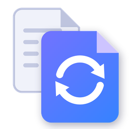
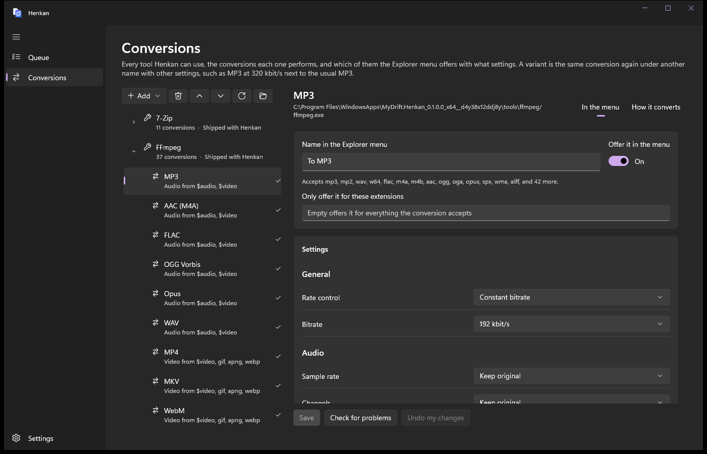
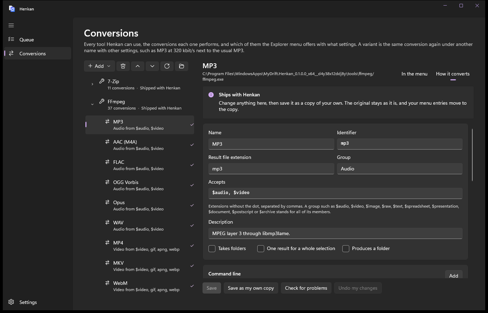
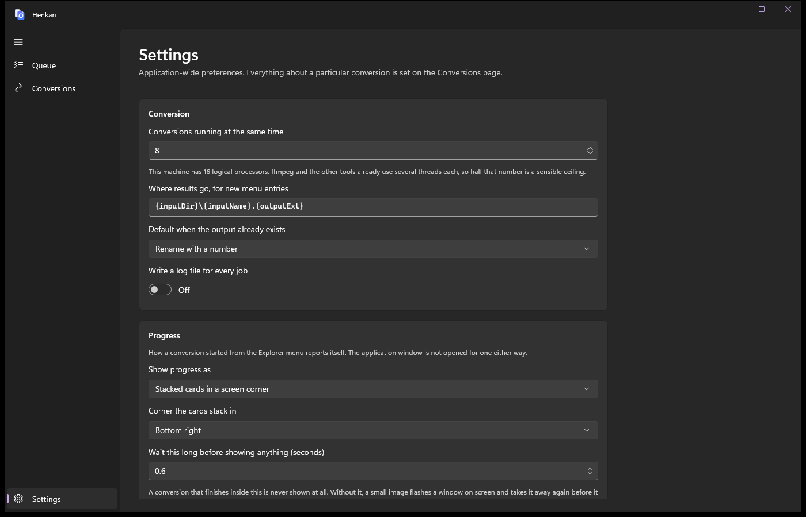

<p align="center">
  
</p>

<h1 align="center">Henkan</h1>

<p align="center">
  <b>Convert any file from the Explorer right-click menu.</b><br>
  Documents, spreadsheets, slides, PDFs, images, audio, video and archives, with the settings you choose, without opening anything.
</p>

<p align="center">
  
  
  
  
</p>

---

Right-click a file, choose **Henkan**, pick what it should become. The conversion runs
in the background, a small card in the corner of the screen shows its progress, and
the result lands next to the original. Select several files and they are all
converted; select several PDFs or images and they can become one.

Henkan does not reinvent the converters. It drives the tools that already do each job
best: FFmpeg, ImageMagick, Ghostscript, 7-Zip, Microsoft Office and LibreOffice. What it
adds is one place to decide which conversions you want, with which settings, and a menu
that only ever offers what makes sense for the file you clicked.

## Install

Download the latest **Henkan-*version*-x64.zip** from
[Releases](https://github.com/MyDrift-user/henkan/releases), unzip it, right-click
**Install.ps1** and choose **Run with PowerShell**. Windows asks once to trust Henkan's
signing certificate, then installs it. Right-click any file afterwards and pick
**Henkan**.

## Highlights

- **Right where you need it.** A single **Henkan** entry in the Windows 11 context menu,
  listing only the conversions that fit the selected files. An MP3 is never offered a
  resize, a photo is never offered an MP3.
- **Over 180 conversions built in.** Word, Excel and PowerPoint in every format they
  save, templates and macro files included; PDF to images, text or PDF/A; slides to
  video; H.264, H.265 and AV1 video; lossless and lossy audio; ZIP, 7z and TAR.GZ.
- **Several files into one.** Merge PDFs, put a stack of scans into one PDF, pack a
  selection or a folder into a single archive.
- **Your settings, not defaults.** Every conversion has its own menu entry with its own
  options: bitrate, quality, resolution, page, where the result goes and what happens
  to the original. Add a variant for a second set, such as MP3 at 320 kbit/s next to
  the usual one.
- **Extensible without code.** Every conversion is described in JSON, the built-in
  ones included. Point Henkan at any command line tool and its conversions appear in
  the menu, with a form for their options.
- **Out of the way.** No window opens for a conversion. Progress shows as a card in a
  screen corner, as a small window, as a Windows notification or not at all, as you
  prefer.

<p align="center">
  
</p>

## How it is organised

Everything lives on one page, **Conversions**, as a tree:

| | What it is | What you set there |
|---|---|---|
| **Tool** | A program Henkan runs, such as FFmpeg | Where the program is, and the options every one of its conversions shares |
| **Conversion** | One thing that tool can do, such as audio to MP3 | Whether the Explorer menu offers it, under what name, with which settings, and where the result goes |
| **Variant** | The same conversion again with other settings | A name and the values that differ, such as a higher bitrate |

A conversion's second tab, **How it converts**, is the definition itself: which files
it accepts, the command line it runs and the options it declares. Change it and the
settings form follows. The definitions that ship with Henkan are changed through a
copy of your own, and your menu entries move to the copy.

<p align="center">
  
</p>

## What it converts

| From | To |
|---|---|
| **Word documents**, text, HTML, RTF, ODT | PDF, PDF/A, DOCX, DOCM, DOTX, DOTM, DOC, DOT, ODT, RTF, TXT, HTML, MHT, XPS, EPUB, PNG, JPEG, TIFF |
| **Spreadsheets**, CSV | XLSX, XLSM, XLSB, XLTX, XLTM, XLS, XLT, ODS, CSV, tab separated text, HTML, PDF, XPS, PNG, JPEG |
| **Presentations** | PPTX, PPTM, PPSX, PPSM, POTX, POTM, PPT, PPS, ODP, PDF, XPS, a slide as PNG or JPEG, the whole deck as an MP4 or WMV video |
| **PDF** and PostScript | smaller PDF, PDF/A, several PDFs merged into one, PNG, JPEG, WebP, AVIF, multi-page TIFF, plain text, PS, EPS |
| **Images** | PNG, JPEG, WebP, AVIF, JPEG XL, GIF, BMP, TIFF, ICO, JPEG 2000, TGA, DDS, PSD, QOI, PDF; several images into one PDF or one multi-page TIFF |
| **Audio** | MP3, AAC, ALAC, FLAC, WAV, AIFF, Opus, Ogg Vorbis, WMA, AC-3, MP2, WavPack, AMR, iPhone ringtone (M4R) |
| **Video** | MP4 in H.264, H.265 or AV1, MKV, WebM, MOV, ProRes, AVI, WMV, M4V, FLV, 3GP, MPEG, TS, OGV, GIF, animated WebP and PNG, a single frame, the audio track on its own, the video without its sound |
| **Anything**, folders too | ZIP, 7z, TAR, TAR.GZ, TAR.XZ, and back out again: RAR, ISO, CAB and everything else 7-Zip reads can be extracted or converted |

<details>
<summary><b>Which tool does what</b></summary>

| Tool | Runs as | Comes with Henkan |
|---|---|---|
| FFmpeg | `ffmpeg.exe` | yes |
| ImageMagick | Magick.NET, inside Henkan | yes |
| Ghostscript | `gswin64c.exe` | yes |
| 7-Zip | `7z.exe` | yes |
| Microsoft Office | Word, Excel and PowerPoint through COM automation | needs Office installed |
| LibreOffice | `soffice.exe`, headless | needs LibreOffice installed |
| Multi-step | chains the tools above, such as a document to PDF to PNG | yes |

Document conversions use Microsoft Office when it is installed and LibreOffice when it
is not, so the same menu entry works on either machine. EPUB and the OpenDocument
templates need LibreOffice. A tool that is missing is shown faded, and its conversions
stay out of the menu until it turns up.

</details>

## Settings

<p align="center">
  
</p>

How many conversions run at once, where results go by default, what happens when a
file of that name already exists, and how progress is shown: stacked cards in a screen
corner of your choice, a window, a Windows notification, or nothing at all.

## Building

You need the .NET 10 SDK and Windows 10 19041 or later. The context menu extension is
compiled with NativeAOT, which also needs the Visual C++ build tools (the "Desktop
development with C++" workload).

```powershell
# Once, from an elevated prompt: a development certificate the package is signed with
.\tools\new-dev-cert.ps1 -Trust

# Fetch the bundled tools, build everything, and produce a signed package
.\build.ps1 -FetchDeps -Package -CertificatePassword henkan

# Install it
Get-ChildItem .\artifacts -Recurse -Filter *.msix | ForEach-Object { Add-AppxPackage $_.FullName }
```

`tools\fetch-deps.ps1` downloads the pinned FFmpeg, Ghostscript and 7-Zip builds listed
in `tools\deps.json`, checks their SHA-256 and places them under `build\tools\`. Nothing
from there is committed. The builds, and their source code, are kept in the
[Bundled tools release](https://github.com/MyDrift-user/henkan/releases/tag/tools-2026-09),
because the services that build them delete old versions.

Pushing a tag such as `v0.0.2` makes the Release workflow build, sign and test the
package, convert real files with every bundled tool, and publish it.

To work on the app without packaging it (no context menu, no bundled tools):

```powershell
dotnet run --project src/Henkan.App -p:Platform=x64 -p:Unpackaged=true
```

## Command line

`henkanc` runs the same engine from a terminal, which makes it easy to script and to
check a conversion before putting it on the menu.

```
henkanc targets --input docx           what a Word document can become
henkanc options pipeline/sheet-png     that conversion's options and their defaults
henkanc convert book.csv --target pipeline/sheet-png --set Resolution=300
henkanc convert a.pdf b.pdf --target ghostscript/merge
henkanc verify --samples .\samples     every conversion against real files
```

`verify` runs every conversion on every sample it accepts and then looks at the bytes
that came out, so a file written under the wrong extension does not pass.

## Adding your own tool

On the Conversions page choose **Add**, then **New tool**, and fill in the form. Or put
a JSON file into `%LocalAppData%\Henkan\backends\`:

```jsonc
{
  "id": "cwebp",
  "name": "cwebp",
  "kind": "process",
  "executable": { "fileName": "cwebp.exe", "probeArguments": ["-version"] },
  "argumentPrefix": [ { "value": "\"{input}\"" } ],
  "argumentSuffix": [ { "value": "-o \"{output}\"" } ],
  "targets": [
    {
      "id": "webp",
      "label": "WebP (cwebp)",
      "outputExtension": "webp",
      "category": "Image",
      "inputExtensions": [ "png", "jpg", "jpeg", "tiff" ],
      "options": [
        { "id": "Quality", "label": "Quality", "kind": "range", "default": "80", "minimum": 0, "maximum": 100 },
        { "id": "Lossless", "label": "Lossless", "kind": "boolean", "default": "false" }
      ],
      "arguments": [
        { "value": "-q {Quality}", "when": "!Lossless" },
        { "value": "-lossless", "when": "Lossless" }
      ]
    }
  ]
}
```

Command lines can use `{input}`, `{inputs}` (every selected file, for a conversion that
combines them), `{inputDir}`, `{inputName}`, `{inputExt}`, `{output}`, `{outputDir}`,
`{outputName}`, `{outputExt}`, `{tempDir}`, `{toolDir}` and every option by its name.
A piece of the command line can be limited to when a condition holds, with `&&`, `||`,
`!`, comparisons and parentheses. [docs/backends.md](docs/backends.md) is the full
reference, and [docs/architecture.md](docs/architecture.md) explains how the pieces fit.

## Project layout

```
src/Henkan.Core            the engine, no UI: definitions, options, templates, backends, queue
src/Henkan.App             the WinUI 3 application and its MSIX package
src/Henkan.ShellExtension  the Explorer menu, an IExplorerCommand handler built with NativeAOT
src/Henkan.Cli             henkanc
tests/Henkan.Core.Tests    xUnit tests
tools/                     dependency fetcher, development certificate, icon generator
docs/                      backend reference and architecture notes
```

## License

GPL-3.0-or-later, see [LICENSE](LICENSE). FFmpeg, Ghostscript and 7-Zip are downloaded
at build time rather than kept in the repository, and come with their own licenses;
[THIRD-PARTY-NOTICES.md](THIRD-PARTY-NOTICES.md) lists every component, its license
and where its source is.
